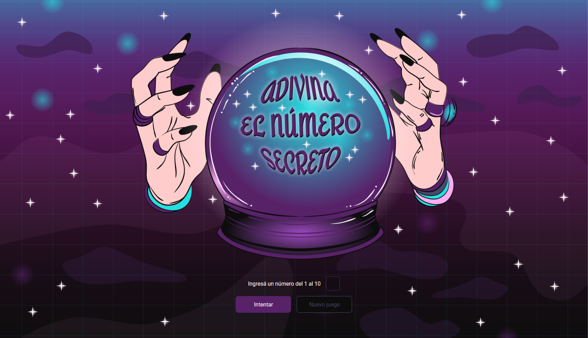

<h1>ADIVINA EL NÚMERO SECRETO :crystal_ball:</h1>

<h2>Descripción del proyecto :bulb:</h2>

Juego del número secreto realizado en la Formación de Principiante en Programación de Alura-Latam. Esta página web nos permite jugar contra el programa para adivinar un número secreto aleatorio.

<h3>Funcionalidad :wrench:</h3>

:small_blue_diamond: El programa elige un número aleatorio entre el 1 y el 10
 :small_blue_diamond: El usuario va ingresando números entre 1 y 10 hasta adivinar el número secreto
 :small_blue_diamond: En cada intento el usuario recibe una pista sobre si el número secreto es mayor o menor
 :small_blue_diamond: Al adivinar, el programa le comunica al usuario cuál era el número secreto y en cuántos intentos lo adivinó
 :small_blue_diamond: Se agregó un botón para que al finalizar el usuario pueda comenzar una nueva partida

<h3>Requisitos :clipboard:</h3>

:heavy_check_mark: El input solo acepta números
 :heavy_check_mark: El número secreto debe ser aleatorio
 :heavy_check_mark: Debe mostrar un contador de intentos
 :heavy_check_mark: Incluir un botón para reiniciar el juego

<h3>Mi aporte :nail_care:</h3>

El ejercicio estaba enfocado a Java Script. Así que tomé el código de la app como base (casi sin modificarlo) y elaboré un nuevo diseño para trabajar en la distribución de los elementos, el uso del flexbox y pantallas responsivas a distintos tamaños.

<h2>Acceso al proyecto :link:</h2>
   
    &#9670;
    
    &#9670;
    
    &#9670;
 

<h2>Autoría :woman:</h2>

El proyecto fue desarrollado por Vanina Denegri en base a los diseños y los códigos provistos por Alura-Latam.
 
 
    &#9632;
    
    &#9632;
    
    &#9632;

<h2>Reconocimientos :crown:</h2>

Links útiles y utilizados para realizar este README:
 
 
    &#9679;
    
    &#9679;
    
    &#9679;

<h2>Muestrame tu apoyo :gift_heart:</h2>

 
Si te gustó mi proyecto podés dejarme alguna estrellita :star:
 
Mandarme algún mensaje :e-mail:
 
O seguirme en redes para comentar y compartir :bell:
 
También podés darme los reconocimientos correspondientes si es necesario :gift_heart:  

<h2>Notas finales :exclamation:</h2>

Estos son mis proyectos como principiante. Pongo mucho esfuerzo en descubrir cosas nuevas. Aún me quedan cosas por aprender, mejorar mis "buenas prácticas", trabajar en el responsive, utilizar mejor GitHub, etc., etc., etc. Por favor, si tenés algún comentario para ayudarme a crecer lo recibiré atentamente siempre y cuando venga con respeto.

<h2>Licencia :warning:</h2>

Este proyecto está bajo la licencia 
